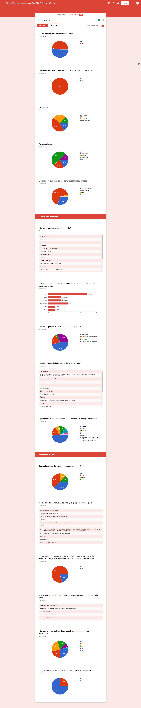
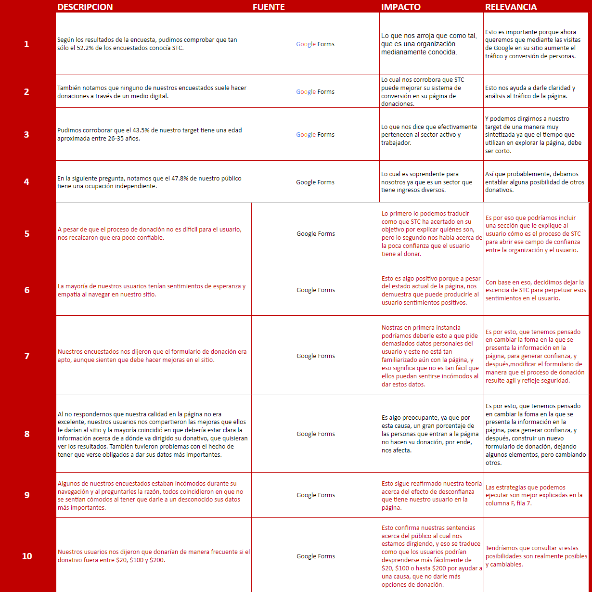
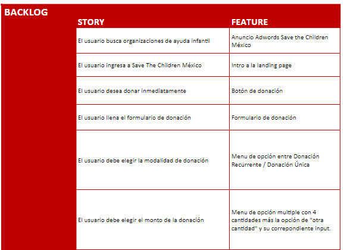
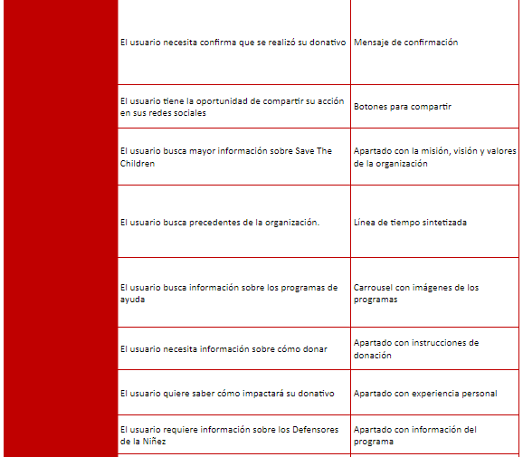
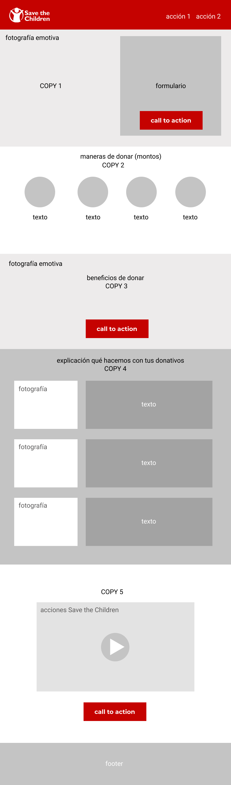
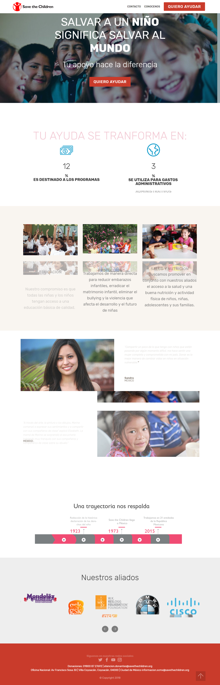
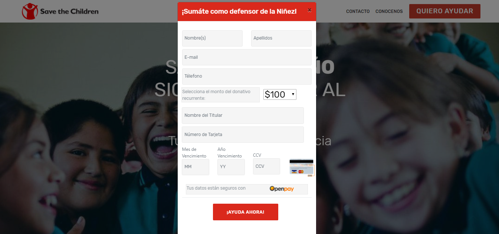
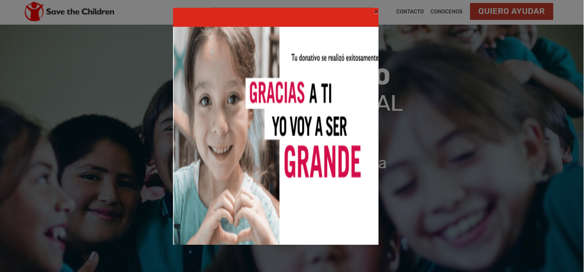

# * Proyecto Sprint #2 - *Track UX Laboratoria**
* Organización con la que se trabajó: *Save the Children México**

*Introducción: Save the Children es la organización líder en la defensa y promoción de los derechos de niñas, niños y adolescentes, que surgió hace más de 90 años como una respuesta humanitaria después de la Primera Guerra Mundial.*

# *Objetivo*

Generar donantes recurrentes a través del journey que hace un usuario a través de la landing page (http://apoyo.savethechildren.mx)

# *Equipo:*

+ Product Owner: Elzbeth Blanco
+ UX Designers: Carmen Vega y Adriana Dillarza
+ UX Researchers: Karina Quezada, Jazmín Solís y Tania Sosa

# *Estrategia:*

+Reforzar la credibilidad de STC aumentando el número de visitantes convertidos a donantes.

*Objetivos SMART:*

+ Atraer la atención de futuros donantes y de donantes activos.
+ Crear empatía con los usuarios

# *Problema*

+ No se muestra información o imagenes que llame la atención del público.
+ No se genera suficiente confianza en el donador

# *Causas*

+ El contenido debe ser empático
+ El que se usa hasta el momento es muy triste
+ Falta de personal para controlar el contenido

# USER PERSONA

Se debe establecer quien es el user persona para poder entender como reaccionaría y con esto crear el journey de donación

# CUSTOMER JOURNEY MAP

En base al user persona definido anteriormente se define su jouney map

# TESTEO DE JOURNEY ACTUAL

Para poder ver las reacciones del usuario con el journey de donación actual se creo un prototipo interactivo con la herramienta Invision;con el que se podra seguir el como es donar y conocer las reacciones de los usuarios. El Journey que seguirán es el siguiente:

https://invis.io/26GCC2Y8VTR

# ENCUESTA

Con el prototipo anterior se creó una encuesta la cual arrojo los siguientes resultados:

# INSIGHTS

En base a los resultados obtenidos en la encuesta se pudieron obtene varios insights los cuales se muestran a continuación:

# BACKLOG

Con los datos de toda la investigación se comenzó a crear el backlog de producto y se procedió a proponer soluciones

# *Sketch*

# SOLUCION

Al final se hizo una combinación de aspectos de las propuestas y el resultado final se muestra a continuación:
Landing Page

Formulario Donación

Agradecimiento de donación

